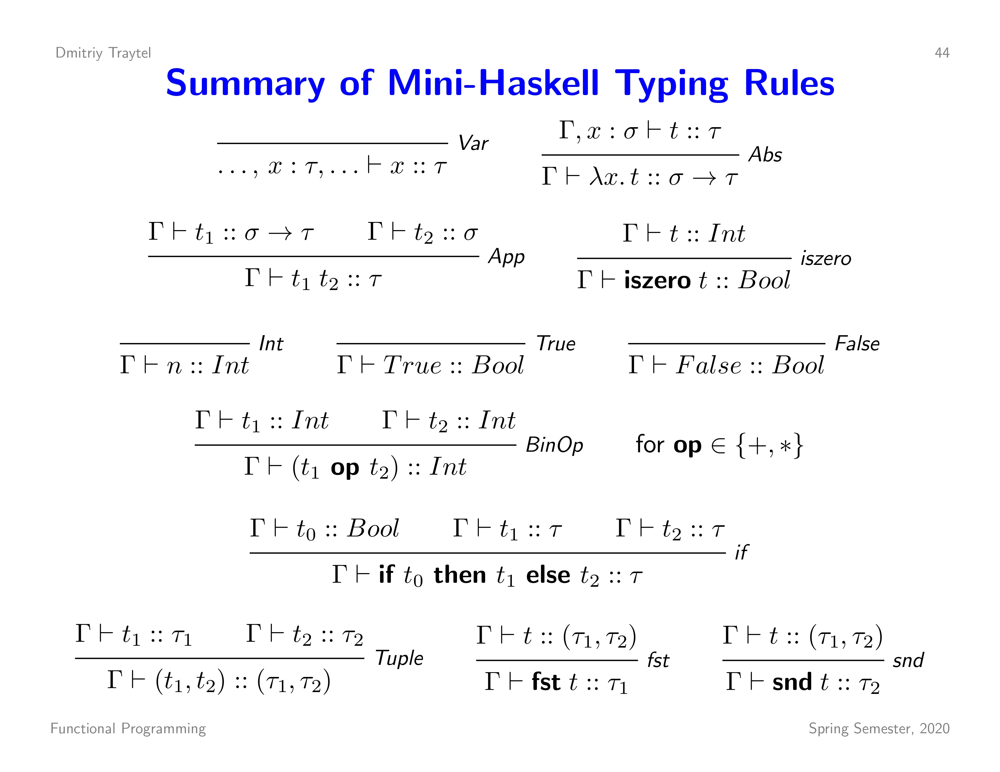

# Mini-Haskell Type Inference Tool

This tool is based on the ETHZ course Formal Methods and Functional Programming. Its goal is to help you understand the type inference process of the Mini-Haskell language.

## Mini-Haskell

Mini Haskell consists of the following rules:

## How does it work?

The tool takes a Mini-Haskell expression as input and parses it into an Abstract Syntax Tree (AST). For this, we wrote our own Grammar. It's not clear that this grammar is exactly the grammar which the creators of Mini-Haskell had in mind.

With the AST, we can now create a type inference tree. This tree is created by recursively applying the type inference rules to the AST.

Using this tree, we can generate the constraints for the type of the expression. The Algorithm has about three actions:

1. Accumulate: In this step, we match two rules and infer more constraints.
2. Remove: In this step, we choose a simple rule (e.g., t=Int) and replace every occurrence of t with the rhs of the rule.
3. Substitute: In this step, we infer the type of the expression by substituting types with more concrete types.

## Contribution

This tool was developed by students of the ETHZ course Formal Methods and Functional Programming. Feel free to contribute to the project by visiting the GitHub repository. If you find mistakes, please open an issue on Github.